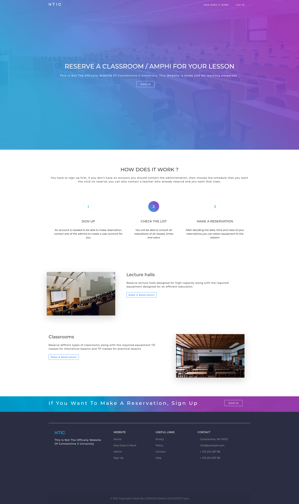
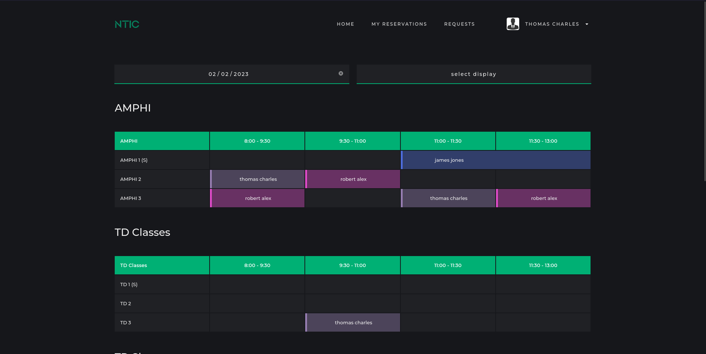
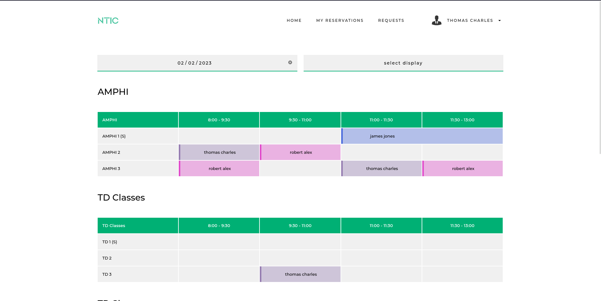
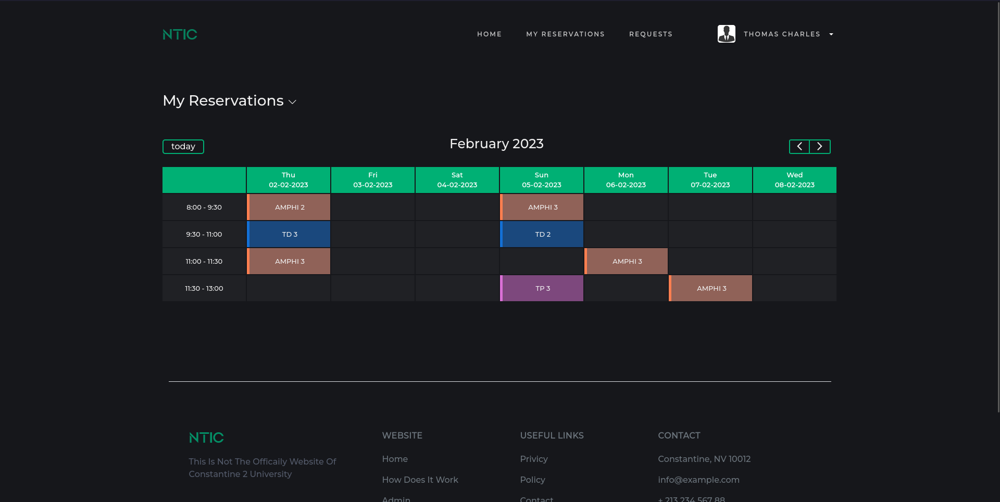
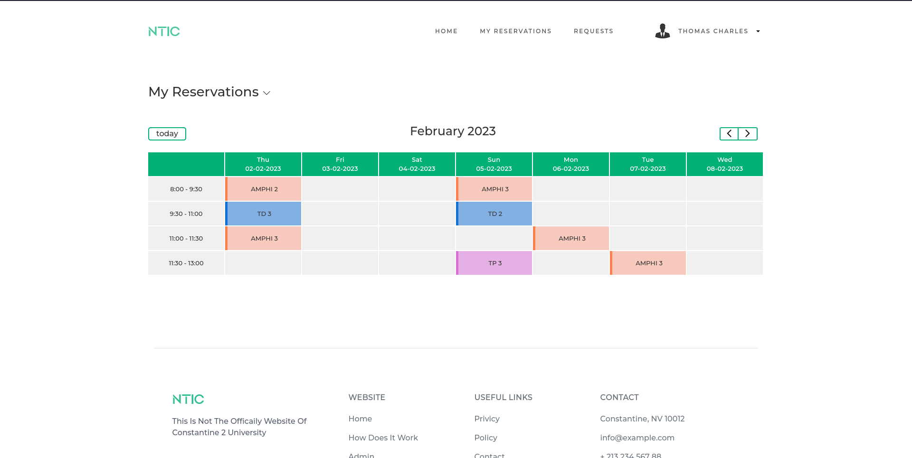
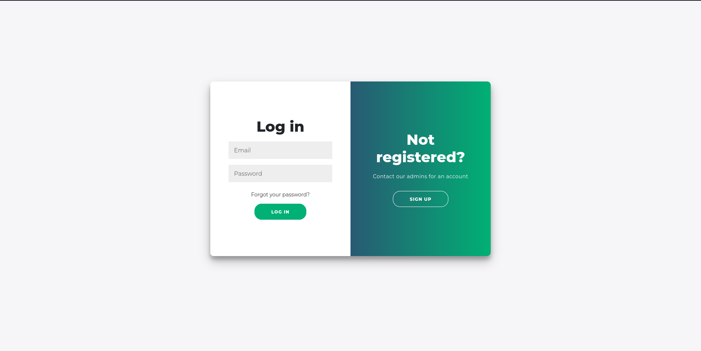
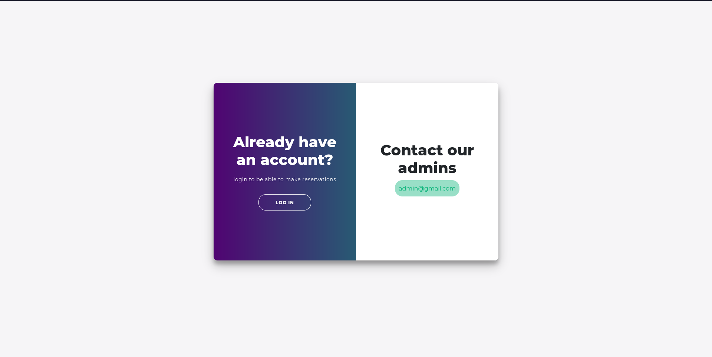
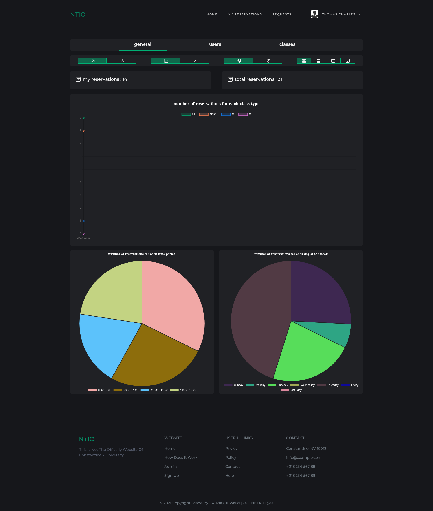
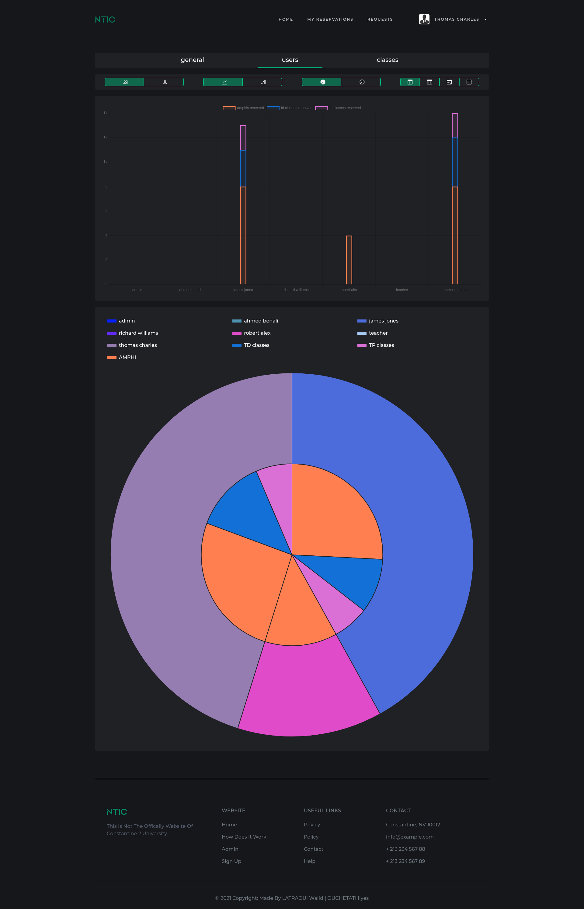
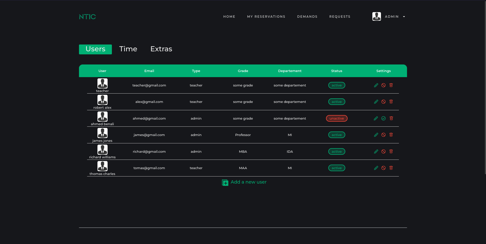

# First project PHP clas managment system

php version must be 8

javascript and cookies must be enabled

database phpmyadmin 10.4.21 mariaDB

## features
- login
- normal users and admin users
- make reservations
- delete reservations
- request other reservations
- dark/light mode
- stats page
- edit profile
- check your schedule

## Screenshots

dark             |  light
:-------------------------:|:-------------------------:
  |  
  |  

login             |  register
:-------------------------:|:-------------------------:
  |  

stats1             |  stats2
:-------------------------:|:-------------------------:
  |  

## Installation 
works on xampp

create database with the name 'base':
http://localhost/project/pages/CREATE_DATABASE.php
if not named 'base' change the name of 
the database in the file pages/connect.php to your preferred database name

to check your database's strict mode input this in your database's sql console :
-------------> SHOW  variables LIKE '%strict%';
to disable it :
------------------------> SET GLOBAL innodb_strict_mode=OFF;

register.php file is for manual regestration 
and not intended for the final version of the project
http://localhost/<PROJECT_NAME>/pages/register.php 
for manual regstration
